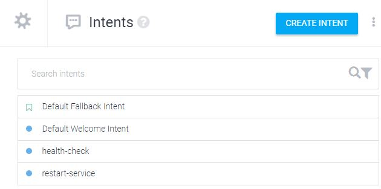
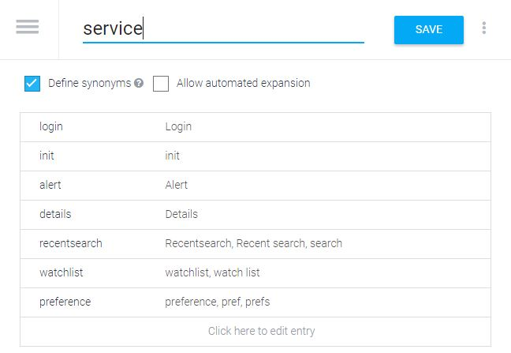
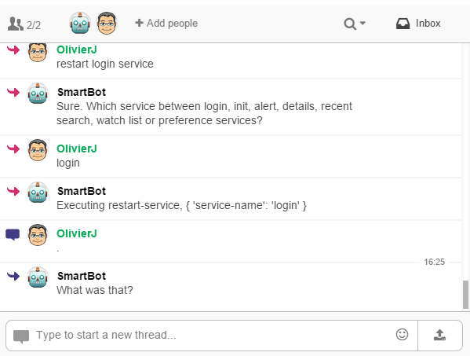

# Smarter Hubot with api.ai

Getting to a better, conversational user experience, with Hubot 🤖

<!-- more -->

## The rise of the robots in IT

I have been a [big fan](https://ojacques.github.io/blog/ChatOps-interview/) 
of adding bots in the middle of our IT operations. It has been extremely 
useful, like getting super powers as we talk to our bot to accomplish 
complex, but now mostly automated, tasks.

What bugs me to this date is that it is hard to figure out what to say to the 
bot. Our chat rooms are full of `@hubot help`, as we try to remember **how**
to formulate our order to the bot.

In a simple effort to standardize, we used [Hubot's general command syntax](https://github.com/eedevops/hubot-enterprise/wiki/api#general-command-syntax),
which helped to at least be consistent across our scripts. 
User will call it like that:

```
@hubot close issue 559
```

where:

* **verb** is close
* **entity** is issue
* **parameters**: whatever matches the regex `[ ]?(.*)?`

But this has not been enough to really have a better user to bot experience.

## AI to the rescue - conversational User Experience

There are many ways to add great [conversational user experience](https://medium.com/swlh/conversational-ui-principles-complete-process-of-designing-a-website-chatbot-d0c2a5fee376) to the human/bots
dialogs:

* [hubot-conversation](https://www.npmjs.com/package/hubot-conversation)
a simple coffeescript which enables conversations. It's basic, you need to 
handle the dialogs logic in each and every hubot's skill/script, but it gets 
the job done.
*  Use an hosted AI engine which will add some smartness in the dialogs. Microsoft's
[LUIS](https://www.luis.ai), Facebook's [wit.ai](https://wit.ai) and Google's
[api.ai](https://api.ai) are few examples. 

I got started with API.AI.

## Proof of concept

### API.AI

So, I took few hours to understand and build a conversational model with 
[api.ai](https://api.ai) (easy, really). My PoC would understand how to restart sub systems
and run an health check. The intent is to do this in a very natural, not 
prescriptive way.

My PoC model has 2 intents: `restart-service` and `health-check`



It also has 2 entities: `environment` and `service`



### Hubot

It got a bit trickier with Hubot. Basically, you want to hear everything 
and once api.ai concludes on the intent and entities, do a `robot.emit` for
further action.

Long story short, I got it working with Flowdock and its threading model.
We may have to handle this differently depending on the hubot adapter we are
on.

### Results

This is the kind of dialog I can get with this simple model:



Quite happy with how the conversation flows! It's much more natural. there
is actually less room for errors, and we can refine the dialog as we
train the bot over time.

## Try it out yourself

API.AI has a cool feature where you can publish the model in a simple dialog. 
Feel free to try it out by yourself:

<iframe
    width="350"
    height="430"
    src="https://console.api.ai/api-client/demo/embedded/e9fdcda1-c5dc-44df-8f88-ad472dae436e">
</iframe>

## Show me the code!

Alright, this PoC is [all on :octocat: Github](https://github.com/ojacques/hubot-api-ai-poc)


